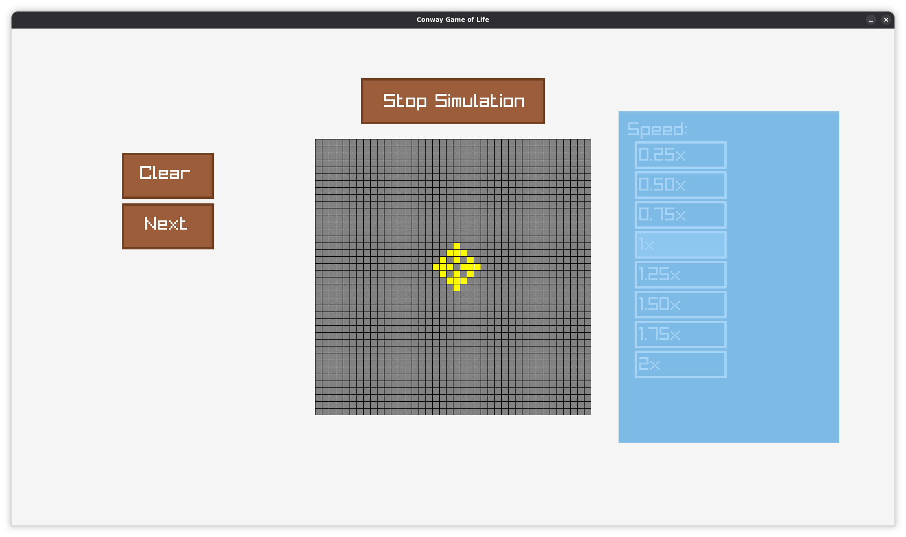

# Conway's Game of Life

An implementation of Conway's Game of Life written in [Odin](https://odin-lang.org/).

[](https://odin-lang.org/)
[](https://www.linux.org/)
[](#license)
[]()

## Table of Contents

- [Installation](#installation)
    - [From Source](#from-source)
    - [From Releases](#from-releases)
- [Usage](#usage)
- [Screenshots](#screenshots)
- [License](#license)

## Installation

### From Source

1. Clone the repository:
   ```bash
   git clone https://github.com/parssarica/gameoflife.git
   cd gameoflife
   ```

2. Build the application:
   ```bash
   odin build .
   ```

3. (Optional) Install to `/usr/local/bin`:
   ```bash
   sudo cp gameoflife /usr/local/bin
   ```

### From Releases

1. Download the latest release from [GitHub Releases](https://github.com/parssarica/gameoflife/releases).

2. Extract and install:
   ```bash
   unzip gameoflife-*.zip
   sudo cp gameoflife /usr/local/bin
   ```

## Usage

Run the Game of Life application:

```bash
./gameoflife
```

- Toggle simulation via start / stop simulation button
- Change speed with speed menu
- See game of life step by step with the next button

## Screenshots


*Main window*


*Running game of life*

## License

This project is licensed under the [MIT License](LICENSE).
